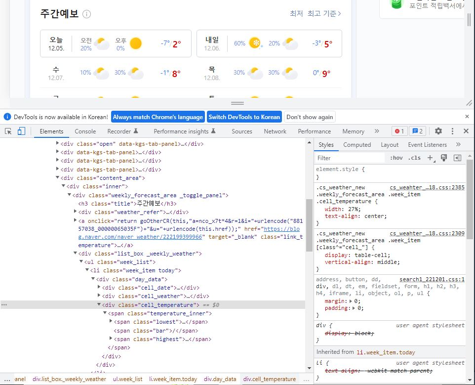

### 16101370 박현수 Term Project

이 프로젝트는 **파이썬을 통해 날씨를 크롤링하고 내가 원하는 지역의 날씨를 출력하는 프로그램** 입니다.

실행 예제는 **example.md**를 참고 바랍니다.

* 간략한 코드 설명
	* 구글에서 코드를 크롤링 하여 가져오기 위한 모듈인 BeautifulSoup와 requests를 import 해옵니다.
	* 크롤링 하여 가져올 웹페이지를 requests를 이용하여 그 웹페이지의 소스코드를 가져온 뒤 
	* BeautifulSoup를 이용하여 Parsing 해옵니다.

	* 

 다음과 같이 내가 원하는 부분을 find를 이용하여 가져온 뒤 그것들을 출력합니다.
	* 위 내용들을 while문을 이용하여 계속 반복하도록 합니다.